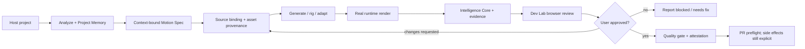

# MotionLoom

[](https://github.com/lenhonbp/MotionLoom/actions/workflows/quality.yml)
[](https://www.npmjs.com/package/motionloom)
[](https://www.npmjs.com/package/motionloom)
[](LICENSE)
[](https://nodejs.org/)
[](https://www.python.org/)
[](https://agentskills.io/specification)

**Project-aware animation production and runtime verification for coding agents.**

MotionLoom is an independent open-source Agent Skill for building UI motion, Lottie and dotLottie scenes, Rive/GSAP/Framer Motion experiences, character body rigs and traceable animation assets inside an existing project. It does not treat animation as an isolated prompt: it binds the work to the host project's context, records decisions and provenance, renders through a real runtime, hands the exact candidate to an internal Dev Lab, and stops before Git side effects until the user approves.

> **MotionLoom is not an auto-approval layer.** A valid signature, a passing heuristic, or a successful render proves only the contract it checks. Visual quality, intent, accessibility and PR authorization remain reviewable human decisions.

## Why MotionLoom

Most animation helpers optimize for generating one asset quickly. That breaks down when an Agent has to work in a real product: it can lose the project's motion language, select an untraceable asset, render a placeholder instead of the target runtime, mix evidence from another task, or open a PR before the user has inspected the result.

MotionLoom turns that fragile sequence into a bounded production system. Its durable Project Memory survives long gaps between animation tasks and project relocation; its Intelligence Core keeps context, provenance, capability selection and Motion IR connected; its runtime adapters produce evidence instead of prose claims; and its Dev Lab is a mandatory review handoff rather than a separate Agent or a static demo catalog.

## What it provides

| Capability | What the Agent gets | What MotionLoom refuses to do |
|---|---|---|
| **Project binding** | Project context, package/design-token discovery and durable `.motionloom/project-memory.json` | Reuse memory across projects or silently continue through missing context |
| **Motion planning** | Framework-aware Motion Spec, timing/easing/accessibility budgets and framework selection | Present a template as a project-integrated result |
| **Asset provenance** | Required `source_binding`, authority, license and SHA-256 traceability | Promote unknown, unlicensed or placeholder production assets |
| **Runtime truth** | Lottie/dotLottie, SVG cutout rig, Rive, GSAP and Framer Motion evidence from real runtime paths | Call scaffold, static validation or a heuristic score visual approval |
| **Agent intelligence** | Project graph, provenance, Motion IR, replay, semantic lint, continuity and fix plan | Convert confidence, benchmark output or warnings into approval |
| **Human review** | Exact candidate URL, frame checkpoints, checklist, review artifact and handoff report in Dev Lab | Confirm, push or open a PR without explicit user authorization |

## The production contract



Every handoff is machine-readable. The typical bundle under `artifacts/<task-id>/` includes the task ledger, context hash, motion spec, manifest, runtime snapshots, telemetry, project graph, provenance, lint and continuity reports, fix plan, browser-review candidate, review decision, execution report and next-Agent handoff.

## Quick start

### Install the public CLI

```bash
npm install --global motionloom
motionloom doctor --json
motionloom --help
```

MotionLoom supports **Node.js 18+** and **Python 3.11+** on Ubuntu, macOS and Windows. The npm wrapper is the cross-platform surface: it discovers the platform Python executable and delegates to the same canonical contracts used by a repository checkout.

### Start from a real project

Run the first commands from the project that owns the animation. Do not copy the example context into production; generate a fresh context from the host project.

```bash
cd /path/to/your/project

# Understand the project and bootstrap/recover durable memory.
motionloom analyze . --init-memory
motionloom memory inspect --project-root . --json

# Bound traversal when the host project is large; truncation is reported, never hidden.
motionloom analyze . --max-files 2500 --max-bytes 25000000 --max-seconds 10

# Plan and generate the scene using the selected framework.
python3 /path/to/MotionLoom/src/core/spec.py generate loading \
  --context project-context.json --output motion-spec.json --loop

# Render real runtime evidence and prepare the Dev Lab review handoff.
motionloom render loading
motionloom devlab loading

# Validate the exact task bundle before any Git side effect.
motionloom quality-gate --scene loading \
  --context project-context.json \
  --task-dir artifacts/loading-task \
  --require-browser-review --require-intelligence --require-p1 \
  --require-benchmark --require-telemetry --require-attestation

# Local-only by default. A user must review and explicitly authorize side effects.
motionloom pr loading --task-dir artifacts/loading-task
```

For a source checkout, use `git clone https://github.com/lenhonbp/MotionLoom.git`, run `npm install`, and replace the global command with `node bin/motionloom.mjs` or the corresponding Python/Node script shown in the [development guide](CONTRIBUTING.md).

## Durable Project Memory

Project Memory is the continuity layer for Agents that return to animation after many unrelated tasks or a new context window. It stores project identity, motion principles, asset and runtime policy, accepted/rejected decisions, user-confirmed outcomes and freshness/invalidation state in `.motionloom/project-memory.json`.

```bash
motionloom memory init --project-root <project>
motionloom memory inspect --project-root <project> --json
motionloom memory refresh --project-root <project> --json
motionloom memory recover --project-root <project> --json
motionloom memory validate --project-root <project> --json
```

The memory integrity hash excludes only the mutable checkout path; Git remote or package identity remains the project binding. Direct edits to durable content fail closed. A stale, invalid, missing or cross-project memory produces a machine-readable recovery state and cannot silently influence generation or approval. Durable decisions and outcomes require `--user-confirmed`.

Read the [Project Memory schema](schemas/project-memory.schema.json), [2.1.0 release note](docs/releases/2.1.0.md) and [Skill instructions](SKILL.md) for the full lifecycle.

## Verified runtime matrix

| Runtime or format | Capability level | Evidence path |
|---|---:|---|
| Lottie JSON | Verified | Runtime snapshot renderer and manifest validation |
| dotLottie v2 | Verified | Node/`fflate` packaging, manifest entry and checksum validation |
| SVG cutout body rig | Verified | Parent-first hierarchy, named anatomy and pose evidence |
| Rive Canvas | Verified | Browser adapter, state-machine/input binding and snapshots |
| GSAP | Verified | Browser adapter, deterministic timeline scrub and snapshots |
| Framer Motion | Verified | Browser adapter, reduced-motion checks and snapshots |
| Spine | Scaffold only | Requires a framework-specific runtime adapter and evidence |
| Three.js | Scaffold only | Requires a framework-specific runtime adapter and evidence |

Capability selection uses `agent-card.json` and the capability registry. A runtime is not promoted from `scaffold_only` to `verified` because a template exists; its adapter evidence and CI contract must pass.

## Evidence, trust and review

MotionLoom keeps distinct layers distinct:

| Layer | It proves | It does not prove |
|---|---|---|
| Runtime evidence | The selected runtime produced the declared snapshots and observed state | That the motion is aesthetically correct or user-approved |
| Provenance | Which source/material/product bytes were used and how they hash | That the source is appropriate beyond the declared authority/license contract |
| Semantic lint and benchmark | Bounded rule findings, risk signals and performance measurements | Human visual quality or intent acceptance |
| Signed attestation | A trusted signer signed the same task-bound hashes under the policy | Reviewer consent, accessibility approval or PR authorization |
| Dev Lab review | The user saw the exact candidate and recorded a decision | A future candidate is automatically approved |

`approval` remains `false` in attestation and verifier artifacts. The default PR mode is local-only (`OPEN_PR=0`); commit, push and pull-request operations remain explicit side effects.

## How an Agent uses the Skill

The public integration surfaces are intentionally small and inspectable:

1. `SKILL.md` gives the Agent the imperative workflow, progressive-disclosure references and non-negotiable contracts.
2. `agent-card.json` advertises inputs, outputs, verified capabilities, recommended integrations and side-effect policy.
3. `motionloom` exposes a cross-platform command surface for analysis, memory, rendering, Dev Lab, evidence, quality and PR preflight.
4. `artifacts/<task-id>/` provides a durable, machine-readable handoff instead of requiring another Agent to infer state from chat.

The Skill can trigger or suggest an internal browser-capable Agent to open the Dev Lab after rendering. Dev Lab is post-render review infrastructure, not a competing Skill. The user can request changes, receive a structured fix plan and rerender selectively, or explicitly confirm the PR path.

## Repository map

| Path | Purpose |
|---|---|
| `SKILL.md` | Installable Agent Skill contract |
| `agent-card.json` | Capability discovery and side-effect policy |
| `bin/motionloom.mjs` | Cross-platform npm CLI entrypoint |
| `src/core/` | Analyzer, Motion Spec and runtime snapshot engine |
| `src/rig/` | Character body rig and pose engine |
| `templates/` | Lottie, Rive, GSAP and Framer Motion templates |
| `scripts/` | Analysis, rendering, evidence, memory, intelligence, reports and PR preflight |
| `schemas/` | Versioned machine-readable contracts |
| `references/` | Progressive-disclosure implementation references |
| `docs/` | Framework selection, checklists, audits and release notes |
| `dev-lab/` | Self-contained browser review workbench and harness |
| `artifacts/<task-id>/` | Per-task evidence, report and handoff bundle |
| `tests/` | Regression, adversarial and deep-stress evaluation harnesses |

## Documentation map

| Need | Start here |
|---|---|
| Install or understand the full lifecycle | [SKILL.md](SKILL.md) |
| Choose a runtime | [Framework selection](docs/FRAMEWORK-SELECTION.md) and [runtime capability reference](references/runtime-capability.md) |
| Run a review-ready scene | [Production checklist](docs/CHECKLIST.md) and [browser review contract](references/browser-review-contract.md) |
| Understand Agent intelligence | [Intelligence Core](references/intelligence-core.md) and [roadmap](ROADMAP.md) |
| Run labeled project evaluation | [Project corpus manifest](tests/evals/project-corpus.json) and `python3 scripts/eval-projects.py --allow-insufficient` |
| Understand trust boundaries | [Signed attestation](references/signed-attestation.md) and [2.0.0 release note](docs/releases/2.0.0.md) |
| Check current evidence posture | [Current status](docs/STATUS.md), [external corpus evidence](docs/audits/external-project-corpus-2026-08-13.md) and [historical audit snapshot](AUDIT-REPORT.md) |
| Contribute code or docs | [CONTRIBUTING.md](CONTRIBUTING.md) |
| Report a vulnerability or request help | [SECURITY.md](SECURITY.md) and [SUPPORT.md](SUPPORT.md) |
| See version history | [CHANGELOG.md](CHANGELOG.md) and [release notes](docs/releases/) |

## Development and release checks

```bash
npm install
python3 scripts/skill-doctor.py --json
python3 tests/scripts/run_tests.py
python3 scripts/eval-intelligence.py
python3 scripts/eval-projects.py --allow-insufficient
npm run release:verify
npm run runtime:test
npm run audit:deep
npm publish --dry-run --access public
```

The GitHub Actions workflow runs the Project Memory and CLI contract on Ubuntu, macOS and Windows, then runs the full evidence-aware quality suite on Ubuntu. A package dry-run is part of release preparation. See [CONTRIBUTING.md](CONTRIBUTING.md) for the clean-checkout procedure and [CHANGELOG.md](CHANGELOG.md) for release discipline.

## Automated CI/CD

MotionLoom separates verification from publication. Pull requests and pushes to `main` run the quality, documentation, security and relevant Dev Lab workflows. A weekly Dependabot job proposes dependency updates for the root package, Dev Lab and GitHub Actions. The npm release workflow is manual only, protected by the `npm-release` environment, and requires the maintainer to choose the distribution tag; GitHub release creation is an explicit input rather than an automatic side effect.

| Workflow | Trigger | Responsibility |
|---|---|---|
| `quality.yml` | Pull request, `main`, manual | Cross-platform memory/CLI matrix and full evidence-aware quality suite |
| `docs.yml` | Documentation/package changes, `main`, manual | Internal links, metadata, workflow safety, Skill Doctor and npm tarball inspection |
| `security.yml` | Pull request, `main`, weekly schedule, manual | Dependency review and CodeQL for JavaScript/Python |
| `devlab.yml` | `dev-lab/**` changes, `main`, manual | Build and retain the browser review workbench artifact |
| `release.yml` | Manual dispatch only | Regression, npm publish with provenance and optional GitHub release |

To enable npm publication, configure a protected GitHub environment named `npm-release` and either add the `NPM_TOKEN` environment secret or configure npm trusted publishing for this repository. Each manual run must provide `release_version`; the workflow verifies package/changelog/release-note alignment before publishing. The workflow never runs on a pull request and never changes MotionLoom's user-review or approval contract.

## License

MotionLoom is released under the [MIT License](LICENSE). Third-party runtime packages and source assets retain their own licenses and attribution requirements.

## References

[1]: https://agentskills.io/specification "Agent Skills specification"
[2]: https://docs.lottiefiles.com/en/runtimes "LottieFiles runtimes"
[3]: https://dotlottie.io/spec/2.0/ "dotLottie v2 specification"
[4]: https://rive.app/docs/runtimes/web/web-js "Rive Web runtime"
[5]: https://gsap.com/resources/a11y/ "GSAP accessibility guidance"
