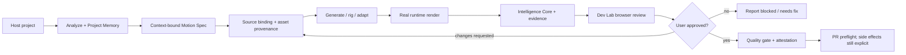

# MotionLoom

[](https://github.com/lenhonbp/MotionLoom/actions/workflows/quality.yml)
[](https://www.npmjs.com/package/motionloom)
[](https://www.npmjs.com/package/motionloom)
[](LICENSE)
[](https://nodejs.org/)
[](https://www.python.org/)
[](https://github.com/lenhonbp/MotionLoom/actions/workflows/apple.yml)
[](https://agentskills.io/specification)

**Project-aware animation production and runtime verification for coding agents.**

MotionLoom is an independent open-source Agent Skill for building UI motion, Lottie and dotLottie scenes, Rive/GSAP/Framer Motion experiences, character body rigs and traceable animation assets inside an existing project. It does not treat animation as an isolated prompt: it binds the work to the host project's context, records decisions and provenance, renders through a real runtime, hands the exact candidate to an internal Dev Lab, and stops before Git side effects until the user approves.

> **MotionLoom is not an auto-approval layer.** A valid signature, a passing heuristic, or a successful render proves only the contract it checks. Visual quality, intent, accessibility and PR authorization remain reviewable human decisions.

> **Release posture:** `motionloom@2.4.0` is the current published release (`latest` on npm and GitHub Release `v2.4.0`). It added a truthful `code_authored` runtime-first lane, a Framer Motion end-to-end reference candidate, identity-bound Dev Lab review evidence and task-bundle discovery that binds by declared scene identity rather than an inferred directory name. It also shipped a native macOS/iOS review alpha under `apps/apple/`. Verify npm/GitHub publication metadata separately; passing evidence never implies user approval.

## Why MotionLoom

Most animation helpers optimize for generating one asset quickly. That breaks down when an Agent has to work in a real product: it can lose the project's motion language, select an untraceable asset, render a placeholder instead of the target runtime, mix evidence from another task, or open a PR before the user has inspected the result.

MotionLoom turns that fragile sequence into a bounded production system. Its durable Project Memory survives long gaps between animation tasks and project relocation; its Intelligence Core keeps context, provenance, capability selection and Motion IR connected; its runtime adapters produce evidence instead of prose claims; and its Dev Lab is a mandatory review handoff rather than a separate Agent or a static demo catalog.

## What it provides

| Capability | What the Agent gets | What MotionLoom refuses to do |
|---|---|---|
| **Project binding** | Project context, package/design-token discovery and durable `.motionloom/project-memory.json` | Reuse memory across projects or silently continue through missing context |
| **Motion planning** | Framework-aware Motion Spec, timing/easing/accessibility budgets and framework selection | Present a template as a project-integrated result |
| **Asset provenance** | Required `source_binding`, authority, license and SHA-256 traceability | Promote unknown, unlicensed or placeholder production assets |
| **Asset consistency** | Measured multi-frame geometry, pivot/footline stability, atlas boundaries and layered-map contracts | Treat a heuristic warning or deterministic pass as artist approval or production authorization |
| **Runtime truth** | Lottie/dotLottie, SVG cutout rig, Rive, GSAP and Framer Motion evidence from real runtime paths | Call scaffold, static validation or a heuristic score visual approval |
| **Agent intelligence** | Project graph, provenance, Motion IR, replay, semantic lint, continuity and fix plan | Convert confidence, benchmark output or warnings into approval |
| **Human review** | Exact candidate URL, frame checkpoints, checklist, review artifact and handoff report in Dev Lab | Confirm, push or open a PR without explicit user authorization |

## The production contract



Every handoff is machine-readable. The typical bundle under `artifacts/<task-id>/` includes the task ledger, context hash, motion spec, manifest, runtime snapshots, telemetry, project graph, provenance, lint and continuity reports, fix plan, browser-review candidate, review decision, execution report and next-Agent handoff.

## Quick start

### Start once. Continue your normal work.

```bash
cd /path/to/your/project
npx --yes motionloom setup
npx --no-install motionloom status
```

This is the entire first-run path. MotionLoom detects the host project and package manager, installs a local development dependency, creates project-bound memory, and adds a small Agent router without overwriting existing guidance. `motionloom init` is an equivalent alias when an Agent or user prefers that wording. It never creates a scene, calls a generator, runs an asset gate, opens Dev Lab, commits, pushes, opens a PR, or grants approval.

After this, keep building your application normally. When you actually begin an animation task, tell your Agent to use MotionLoom. The Agent then reads the relevant workflow rather than showing every schema, contract, or production rule up front.

Use these only if you need them:

```bash
npx --yes motionloom init --dry-run --json     # preview; no install or file changes
npx --no-install motionloom doctor             # check the installed package
npx --no-install motionloom repair --yes       # restore only missing managed pieces
```

MotionLoom supports **Node.js 18+** and **Python 3.11+** on Ubuntu, macOS and Windows. `npx` is the recommended first-run surface; after setup, use the project-local binary through `npx --no-install motionloom ...`. A global install remains optional, not required.

### When you begin animation work

The detail level follows the job rather than the installation. A simple interface motion task starts with a scene plan and runtime render. Importing a third-party or AI-generated visual asset adds the intake path. A production runtime package adds rig, provenance and runtime-specific checks. These are safeguards for the affected artifact, not rules imposed on unrelated product work.

| Your task | Start with | MotionLoom reveals next |
|---|---|---|
| UI motion, loading state, page transition | `motionloom analyze . --init-memory` | Scene plan, runtime render and Dev Lab review |
| Imported or AI-generated frames, sprite atlas, layered map | The same project analysis | Provenance and measured asset-consistency/intake steps |
| Rive, Spine or other packaged runtime asset | The same project analysis | Package, rig and runtime evidence steps |

### Advanced: start from a real project

Run the first commands from the project that owns the animation. Do not copy the example context into production; generate a fresh context from the host project.

```bash
cd /path/to/your/project

# Setup already analyzed the project and bootstrapped durable memory.
npx --no-install motionloom status --json
npx --no-install motionloom memory inspect --project-root . --json

# Bound traversal when the host project is large; truncation is reported, never hidden.
npx --no-install motionloom analyze . --max-files 2500 --max-bytes 25000000 --max-seconds 10

# Plan and generate the scene using the selected framework.
python3 /path/to/MotionLoom/src/core/spec.py generate loading \
  --context project-context.json --output motion-spec.json --loop

# Render real runtime evidence and prepare the Dev Lab review handoff.
npx --no-install motionloom render loading
npx --no-install motionloom devlab loading

# Validate the exact task bundle before any Git side effect.
npx --no-install motionloom quality-gate --scene loading \
  --context project-context.json \
  --task-dir artifacts/<task-id> \
  --require-browser-review --require-intelligence --require-p1 \
  --require-benchmark --require-telemetry --require-attestation --require-asset-provenance

# Local-only by default. A user must review and explicitly authorize side effects.
npx --no-install motionloom pr loading --task-dir artifacts/<task-id>
```

For a source checkout, use `git clone https://github.com/lenhonbp/MotionLoom.git`, run `npm install`, and replace the global command with `node bin/motionloom.mjs` or the corresponding Python/Node script shown in the [development guide](CONTRIBUTING.md).

## Durable Project Memory

Project Memory is the continuity layer for Agents that return to animation after many unrelated tasks or a new context window. It stores project identity, motion principles, asset and runtime policy, accepted/rejected decisions, user-confirmed outcomes and freshness/invalidation state in `.motionloom/project-memory.json`.

```bash
motionloom memory init --project-root <project>
motionloom memory inspect --project-root <project> --json
motionloom memory refresh --project-root <project> --json
motionloom memory recover --project-root <project> --json
motionloom memory validate --project-root <project> --json
```

The memory integrity hash excludes only the mutable checkout path; Git remote or package identity remains the project binding. Direct edits to durable content fail closed. A stale, invalid, missing or cross-project memory produces a machine-readable recovery state and cannot silently influence generation or approval. Durable decisions and outcomes require `--user-confirmed`.

Read the [Project Memory schema](schemas/project-memory.schema.json), [2.1.0 release note](docs/releases/2.1.0.md) and [Skill instructions](SKILL.md) for the full lifecycle.

## Verified runtime matrix

| Runtime or format | Capability level | Evidence path |
|---|---:|---|
| Lottie JSON | Contract verified | Runtime snapshot renderer and manifest validation in repository fixtures |
| dotLottie v2 | Contract verified | Node/`fflate` packaging, manifest entry and checksum validation |
| SVG cutout body rig | Contract verified | Parent-first hierarchy, named anatomy and pose evidence in repository fixtures |
| Rive Canvas | Fixture verified | Browser adapter, state-machine/input binding and representative snapshots |
| GSAP | Fixture verified | Browser adapter, deterministic timeline scrub and representative snapshots |
| Framer Motion | Fixture verified | Browser adapter, reduced-motion checks and representative snapshots |
| Spine | Scaffold only | Requires a framework-specific runtime adapter and evidence |
| Three.js | Scaffold only | Requires a framework-specific runtime adapter and evidence |

Capability selection uses `agent-card.json` and the capability registry. A runtime is not promoted from `scaffold_only` to `verified` because a template exists; its adapter evidence and CI contract must pass.

An Agent can inspect the read-only capability card before choosing a renderer:

```bash
motionloom capability card --format json
```

The card exposes declared compatibility, evidence references, limitations and fallback paths. It does **not** select a runtime, refresh evidence, infer production approval or replace the verification step; use `motionloom intelligence capabilities select --registry capability-registry.json --capability runtime.<id>` immediately before execution.

## Evidence, trust and review

MotionLoom keeps distinct layers distinct:

| Layer | It proves | It does not prove |
|---|---|---|
| Runtime evidence | The selected runtime produced the declared snapshots and observed state | That the motion is aesthetically correct or user-approved |
| Visual Truth Contract | Baseline/candidate frame identity, dimensions, provenance and review-required regions are bound to the scene | That a changed frame is acceptable or user-approved |
| Remediation Learning | User-confirmed correction outcomes and deterministic benchmark history with first-pass metrics | That aggregate history can approve a new animation or replace review |
| Provenance | Which source/material/product bytes were used and how they hash | That the source is appropriate beyond the declared authority/license contract |
| Semantic lint and benchmark | Bounded rule findings, risk signals and performance measurements | Human visual quality or intent acceptance |
| Signed attestation | A trusted signer signed the same task-bound hashes under the policy | Reviewer consent, accessibility approval or PR authorization |
| Dev Lab review | The user saw the exact candidate and recorded a decision | A future candidate is automatically approved |

`approval` remains `false` in attestation and verifier artifacts. The default PR mode is local-only (`OPEN_PR=0`); commit, push and pull-request operations remain explicit side effects.

## Asset provenance tiers

MotionLoom separates **asset origin**, **runtime readiness**, **production eligibility** and **human approval**. This is essential for AI-first workflows: an Agent may create a valid pilot, ingest it into the real runtime and expose it in Dev Lab without being allowed to call that pilot artist-authored or approved for production.

| Authority / origin | Runtime behavior | Production behavior |
|---|---|---|
| `ai_generated` | `runtime_ready` when hashes, license metadata and runtime evidence pass | Never `production_eligible` |
| `ai_assisted` | `runtime_ready` after contract validation | Eligible only after recorded human sign-off and full gate |
| `ai_assisted_human_reviewed` | `runtime_ready` | `review_required` until the declared production gate is complete; no automatic approval |
| `artist_authored` | Runtime-testable when the package is valid | Eligible after verified authority, license, runtime and quality checks; not from Agent self-assertion |
| `unknown` | `blocked` | Blocked |

The readiness value `production_approved` is reserved for a human decision and is not minted by `asset-provenance`, `quality-gate`, attestation or any Agent. Use the following commands against the exact scene artifact:

```bash
motionloom asset-provenance validate --input src/output/<scene>/asset-provenance.json --json
motionloom asset-provenance check --input src/output/<scene>/asset-provenance.json \
  --root src/output/<scene> --mode runtime \
  --manifest src/output/<scene>/manifest.json --json
motionloom asset-provenance check --input src/output/<scene>/asset-provenance.json \
  --root src/output/<scene> --mode production \
  --manifest src/output/<scene>/manifest.json --json
```

The [AI-generated pilot fixture](examples/agent-consumer/ai-generated-pilot-provenance.json) demonstrates the intended boundary: it is transparent and runtime-ingestible, but it cannot pass a production gate merely because an Agent declared it complete.

## Asset consistency compiler

When an Agent creates a character action across many frames, packs a sprite atlas or builds a parallax background, visual plausibility is not enough. MotionLoom accepts a machine-readable contract and measures the referenced artifacts instead of trusting declared dimensions. The standard-library analyzer supports RGBA, RGB with `tRNS`, indexed PNG palettes and grayscale-with-alpha PNGs, so the npm package remains usable on Ubuntu, macOS and Windows without Pillow or native image dependencies.

| Contract | Deterministic checks | Typical failure surfaced |
|---|---|---|
| `identity` | Asset ID, style profile, palette/camera/scale/pivot and reference hash | Frame set silently changes character identity or visual rules |
| `action-set` | FPS, frame count, explicit loop seam, pose timeline, sockets and events | A loop claims continuity without matching first/last frame or required event contract |
| `frame-geometry` | Canvas size, alpha bounds, SHA-256, pivot/footline drift, bbox drift and opaque pixels outside frame rect | One frame contains bleed from a neighboring frame or shifts the feet/pivot |
| `atlas` | Region bounds/overlap, rotation policy and opaque pixels outside declared regions | Packing leaves contamination, overlap or ambiguous UV ownership |
| `layered-map` | Z-order uniqueness, parallax ordering, tile seams, layer/world bounds and camera-safe bounds | A background layer seams at loop edges or the camera can leave world bounds |

Run one contract at a time and keep its JSON result in the task bundle:

```bash
motionloom asset-consistency validate --kind action-set \
  --input src/output/<scene>/hero-walk-action-set.json --root src/output/<scene> --json
motionloom asset-consistency validate --kind atlas \
  --input src/output/<scene>/hero-atlas-contract.json --root src/output/<scene> --strict --json
motionloom asset-consistency report --kind layered-map \
  --input src/output/<scene>/forest-layered-map.json --root src/output/<scene> --json
```

For a production scene, add `consistency_ref` and `consistency_kind` to `manifest.json`. The quality gate and report then bind the contract to the scene only when it is declared; use `--require-asset-consistency` when the task requires the contract to pass. Consistency results expose measured evidence and block mismatches, but they do not grant `artist_authored`, `production_eligible`, `production_approved` or PR authorization.

The repository keeps pass/fail examples under [`examples/agent-consumer/asset-consistency/`](examples/agent-consumer/asset-consistency/) and regression coverage in [`tests/scripts/test_asset_consistency.py`](tests/scripts/test_asset_consistency.py). The npm package exposes `asset:consistency` and `asset:audit` for a quick local smoke check.

## Provider-neutral Artifact Intake and runtime candidates

An AI image, video, pixel-art, rigging or motion-capture tool can contribute an asset without becoming the source of truth for production. MotionLoom records a **generation receipt** (what generated or transformed the asset), a **control track** (reference/style/pose/camera/action controls) and an **export manifest** (exact emitted files and hashes). The provider-neutral registry then checks whether the adapter is evidence-backed, scaffold-only or blocked; it does not invoke a provider API or hold provider credentials.

```bash
# Bind an Agent-managed ImageGen-style output or another provider to deterministic artifacts.
motionloom artifact-intake intake --root <project-root> \
  --registry artifact-adapter-registry.json \
  --receipt <generation-receipt.json> \
  --controls <control-track.json> \
  --export-manifest <export-manifest.json> --json

# Permit only an intake bundle and consistency contracts whose refs/hashes agree.
motionloom runtime-candidate validate --root <project-root> \
  --input <runtime-candidate.json> --json

# Validate skeleton/action/socket/event/export compatibility against an adapter registry.
motionloom rig-compatibility validate --root <project-root> \
  --registry rig-adapter-registry.json --input <rig-compatibility.json> --json
```

The public bundle under [`examples/agent-consumer/artifact-intake/`](examples/agent-consumer/artifact-intake/) demonstrates an ImageGen-shaped receipt without relying on an external API. It advances only to **`runtime_test_ready`** when hashes and corresponding identity/action/frame contracts agree. The companion rig contract demonstrates adapter/skeleton/socket/event checks. Both evidence classes remain **review-required**: they never promote `ai_generated` material, claim `artist_authored`, replace real runtime evidence or approve a pull request. Dev Lab displays their adapter status, bound paths and findings before the user can record review.

## How an Agent uses the Skill

The public integration surfaces are intentionally small and inspectable:

1. `SKILL.md` gives the Agent the imperative workflow, progressive-disclosure references and non-negotiable contracts.
2. `agent-card.json` advertises inputs, outputs, verified capabilities, recommended integrations and side-effect policy.
3. `motionloom` exposes a cross-platform command surface for analysis, memory, rendering, Dev Lab, evidence, quality and PR preflight.
4. `artifacts/<task-id>/` provides a durable, machine-readable handoff instead of requiring another Agent to infer state from chat.

The Skill can trigger or suggest an internal browser-capable Agent to open the Dev Lab after rendering. Dev Lab is post-render review infrastructure, not a competing Skill. The user can request changes, receive a structured fix plan and rerender selectively, or explicitly confirm the PR path.

## Native companion apps (alpha)

`apps/apple/` contains the native-first Apple companion surface. **MotionLoom Studio for macOS** opens a scoped project, exposes the evidence and timeline inspection surface, and can request only allow-listed local checks. **MotionLoom Review for iPhone and iPad** reads a hash-bound review launch descriptor, scrubs evidence, records annotations, and exports a human review decision.

These apps do not replace the Agent, the npm CLI or Dev Lab. They make a project’s artifact state and human review decision visible between Agent sessions. They cannot grant `production_approved`, set `OPEN_PR=1`, push Git changes, publish npm packages, or turn an AI-generated asset into artist-authored material.

Read [the Apple workspace guide](apps/apple/README.md), [the contract boundary](docs/architecture/apple/contracts.md), and [the TestFlight preparation guide](docs/apple-distribution.md) before building locally.

## Repository map

| Path | Purpose |
|---|---|
| `SKILL.md` | Installable Agent Skill contract |
| `agent-card.json` | Capability discovery and side-effect policy |
| `agent-surfaces.json`, `.agents/`, `.claude/`, `.codex/` | Cross-Agent discovery aliases and portability contract |
| `bin/motionloom.mjs` | Cross-platform npm CLI entrypoint |
| `src/core/` | Analyzer, Motion Spec and runtime snapshot engine |
| `src/rig/` | Character body rig and pose engine |
| `templates/` | Lottie, Rive, GSAP and Framer Motion templates |
| `scripts/` | Analysis, rendering, evidence, memory, intelligence, reports and PR preflight |
| `schemas/` | Versioned machine-readable contracts |
| `references/` | Progressive-disclosure implementation references |
| `docs/` | Framework selection, checklists, audits and release notes |
| `dev-lab/` | Self-contained browser review workbench and harness |
| `apps/apple/` | macOS Studio and iOS/iPadOS Review companion sources, Swift packages, Xcode project and local build guide |
| `artifacts/<task-id>/` | Per-task evidence, report and handoff bundle |
| `schemas/visual-truth.schema.json`, `scripts/visual-truth.py` | Provenance-bound visual comparison and review explanation contract |
| `schemas/remediation-history.schema.json`, `scripts/remediation-learning.py` | Append-only remediation/benchmark ledger and aggregate learning metrics |
| `schemas/asset-provenance.schema.json`, `scripts/asset-provenance.py` | Tiered origin, authority, readiness, license, hash and human-review gate for asset candidates |
| `schemas/generation-receipt.schema.json`, `scripts/artifact-intake.py` | Provider-neutral receipt/control/export intake with hash-bound adapter evidence |
| `schemas/runtime-candidate.schema.json`, `scripts/runtime-candidate.py` | Control-to-consistency bridge that permits only hash-compatible runtime test candidates |
| `schemas/rig-compatibility.schema.json`, `scripts/rig-compatibility.py` | Skeleton/socket/action/event/export compatibility evidence for runtime adapters |
| `tests/` | Regression, adversarial and deep-stress evaluation harnesses |

## Documentation map

| Need | Start here |
|---|---|
| Install or understand the full lifecycle | [SKILL.md](SKILL.md) |
| Choose a runtime | [Framework selection](docs/FRAMEWORK-SELECTION.md) and [runtime capability reference](references/runtime-capability.md) |
| Run a review-ready scene | [Production checklist](docs/CHECKLIST.md) and [browser review contract](references/browser-review-contract.md) |
| Understand Agent intelligence | [Intelligence Core](references/intelligence-core.md) and [roadmap](ROADMAP.md) |
| Run labeled project evaluation | [Project corpus manifest](tests/evals/project-corpus.json) and `python3 scripts/eval-projects.py --allow-insufficient` |
| Understand trust boundaries | [Signed attestation](references/signed-attestation.md) and [2.0.0 release note](docs/releases/2.0.0.md) |
| Classify AI-generated or assisted assets | [Asset provenance tiers](schemas/asset-provenance.schema.json), `motionloom asset-provenance`, and the [production checklist](docs/CHECKLIST.md) |
| Bind an internal skill or provider output before runtime testing | [Artifact Intake examples](examples/agent-consumer/artifact-intake/), `motionloom artifact-intake`, and [AI/Agent research](docs/research/ai-animation-tools-2026-report.md) |
| Check control-to-runtime and rig compatibility | `motionloom runtime-candidate`, `motionloom rig-compatibility`, and [production checklist](docs/CHECKLIST.md) |
| Validate visual truth before review/PR | `motionloom visual-truth build|validate` and [production checklist](docs/CHECKLIST.md) |
| Check current evidence posture | [Current status](docs/STATUS.md), [external corpus evidence](docs/audits/external-project-corpus-2026-08-13.md) and [historical audit snapshot](AUDIT-REPORT.md) |
| Build the native review companions | [Apple workspace guide](apps/apple/README.md), [Studio architecture](docs/architecture/apple/studio.md), and [distribution preparation](docs/apple-distribution.md) |
| Contribute code or docs | [CONTRIBUTING.md](CONTRIBUTING.md) |
| Report a vulnerability or request help | [SECURITY.md](SECURITY.md) and [SUPPORT.md](SUPPORT.md) |
| See version history | [CHANGELOG.md](CHANGELOG.md) and [release notes](docs/releases/) |

## Development and release checks

```bash
npm install
python3 scripts/skill-doctor.py --json
python3 tests/scripts/run_tests.py
python3 scripts/eval-intelligence.py
python3 scripts/eval-projects.py --allow-insufficient
npm run release:verify
npm run runtime:test
npm run audit:deep
npm publish --dry-run --access public
```

The GitHub Actions workflow is designed to run the Project Memory and CLI contract on Ubuntu, macOS and Windows, then run the full evidence-aware quality suite on Ubuntu. Read the latest GitHub Actions run rather than treating this README or a historical audit as proof that the current checkout is green. A package dry-run is part of release preparation. See [CONTRIBUTING.md](CONTRIBUTING.md) for the clean-checkout procedure and [CHANGELOG.md](CHANGELOG.md) for release discipline.

## Automated CI/CD

MotionLoom separates verification from publication. Pull requests and pushes to `main` trigger the quality, documentation, security and relevant Dev Lab workflows when their path filters match. A weekly Dependabot job proposes dependency updates for the root package, Dev Lab and GitHub Actions. The npm release workflow is manual only, protected by the `npm-release` environment, and requires the maintainer to choose the distribution tag; GitHub release creation is an explicit input rather than an automatic side effect.

| Workflow | Trigger | Responsibility |
|---|---|---|
| `quality.yml` | Pull request, `main`, manual | Cross-platform memory/CLI matrix and full evidence-aware quality suite |
| `docs.yml` | Documentation/package changes, `main`, manual | Internal links, metadata, workflow safety, Skill Doctor and npm tarball inspection |
| `security.yml` | Pull request, `main`, weekly schedule, manual | Dependency review and CodeQL for JavaScript/Python |
| `devlab.yml` | `dev-lab/**` changes, `main`, manual | Build and retain the browser review workbench artifact |
| `release.yml` | Manual dispatch only | Regression, npm publish with provenance and optional GitHub release |

To enable npm publication, configure a protected GitHub environment named `npm-release` and either add the `NPM_TOKEN` environment secret or configure npm trusted publishing for this repository. Each manual run must provide `release_version`; the workflow verifies package/changelog/release-note alignment before publishing. The workflow never runs on a pull request and never changes MotionLoom's user-review or approval contract.

## License

MotionLoom is released under the [MIT License](LICENSE). Third-party runtime packages and source assets retain their own licenses and attribution requirements.

## References

[1]: https://agentskills.io/specification "Agent Skills specification"
[2]: https://docs.lottiefiles.com/en/runtimes "LottieFiles runtimes"
[3]: https://dotlottie.io/spec/2.0/ "dotLottie v2 specification"
[4]: https://rive.app/docs/runtimes/web/web-js "Rive Web runtime"
[5]: https://gsap.com/resources/a11y/ "GSAP accessibility guidance"
